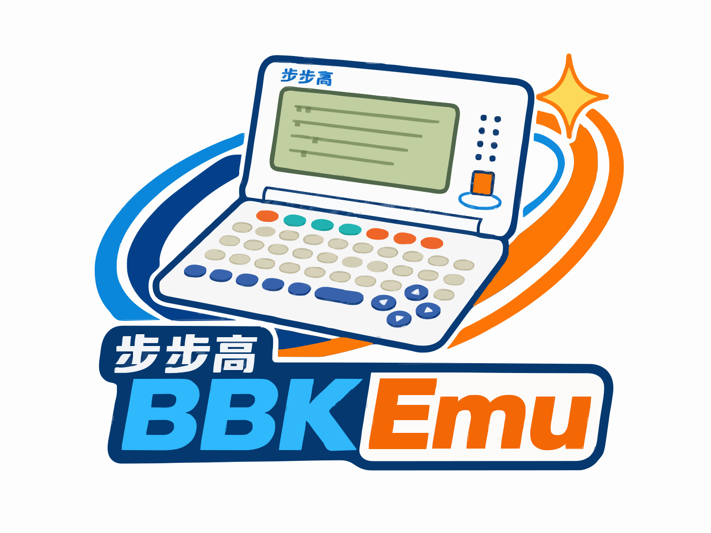

# BBKEmu —— BBK Electronic Dictionary Game Emulator

<p align="center">
  
</p>

<p align="center">
  <a href="https://jiangxincode.github.io/BBKEmu/"></a>
  <a href="https://github.com/jiangxincode/BBKEmu/actions/workflows/ci.yml"></a>
  <a href="https://git.libretro.com/libretro/bbkemu/-/pipelines"></a>
  <a href="https://github.com/jiangxincode/BBKEmu/releases/latest"></a>
  <a href="https://github.com/jiangxincode/BBKEmu/releases"></a>
  <a href="https://sonarcloud.io/dashboard?id=jiangxincode_BBKEmu"></a>
  <a href="LICENSE"></a>
</p>

BBK (步步高) A-series electronic dictionary game emulator written in Rust. Plays `.gam` game files from BBK A4980 and A4988 dictionaries.

## Features

- **Complete 6502 CPU emulation** — using the mos6502 crate for accurate instruction execution
- **Bank-switched memory** — full memory map with flash, RAM, and ROM support
- **LCD display** — 159×96 monochrome framebuffer with ghosting effects
- **Keyboard input** — complete BBK key matrix emulation
- **Audio system** — tone generation with configurable frequency and duration
- **GAM file support** — loads BBK game files with automatic header parsing
- **Multiple models** — supports BBK A4980 and A4988 dictionaries
- **RetroArch integration** — libretro core for use with RetroArch frontend
- **Developer tools** — debugger with breakpoints, watchpoints, and syscall logging
- **Save states** — serialization support for save/load functionality

## Requirements

BBKEmu requires ROM files from a physical BBK dictionary to run games:

- **8.BIN** — Font ROM (2 MiB)
- **E.BIN** — OS ROM (2 MiB)

These files are not distributed with the emulator and must be obtained separately.

## Usage

### Standalone Mode

Download the latest binary from the [Releases](https://github.com/jiangxincode/BBKEmu/releases) page.

The basic usage is listed below, but there are many more options for controlling the behavior of the emulator. See the [Command-line Options](docs/CLI-Options.md) documentation for the full list of options.

```bash
# Basic usage with ROM files
bbkemu game.gam -8 8.BIN -e E.BIN

# If ROM files are in system/BBKEmu/<model>/
bbkemu game.gam

# With common options
bbkemu game.gam --scale 4 --fullscreen --model 4980

# Headless mode for testing
bbkemu game.gam --frames 100 --output screenshot.png
```

**Keyboard shortcuts:** `F5` Save state | `F8` Load state | `F12` Screenshot | `Escape` Exit

### RetroArch Mode (Desktop: Windows / Linux / macOS)

BBKEmu can be used as a libretro core with RetroArch, allowing you to play BBK games with RetroArch's features like shaders and save states.

**Install the core** — choose one of the following methods:

- **Online Updater**: Open RetroArch → **Main Menu → Online Updater → Core Downloader** → select **BBKEmu**
- **Manual**: Download the core from the [Releases](https://github.com/jiangxincode/BBKEmu/releases) page, copy `bbkemu_libretro.dll` (or `.so`/`.dylib`) to RetroArch's `cores/` directory, and `bbkemu_libretro.info` to the `info/` directory

**Load the core in RetroArch:**

1. Open RetroArch
2. Select "Load Core" → "BBKEmu"
3. Select "Load Content" and choose a `.gam` game file
4. ROM files should be placed in `system/BBKEmu/<model>/` (e.g., `system/BBKEmu/A4980/`)

#### RetroArch on Android

The libretro core also runs on Android and can be reused by most Android
RetroArch-based frontends. See [Android Libretro Core](docs/Android-Libretro-Core.md)
for install and build instructions.

#### RetroArch on iOS

The libretro core also runs on iOS (iPhone / iPad). iOS currently requires manual core injection — see
[iOS Libretro Core](docs/iOS-Libretro-Core.md) for install and build instructions.

#### Supported Features

- ✅ Video output (RGB565 pixel format)
- ✅ Audio output (tone generation)
- ✅ Input handling (keyboard mapping)
- ✅ Game loading (.gam files)
- ✅ Save states
- ✅ LCD orientation option (portrait/landscape)
- ✅ CPU/Timer clock rate adjustment
- ✅ SRAM support (flash memory)
- ✅ Cheat codes support

#### Core Options

Configurable from RetroArch's *Quick Menu → Core Options* (LCD orientation,
CPU/Timer clock rate, key repeat interval). See [Core Options](docs/Core-Options.md) for the full list.

#### RetroPad Button Mapping

| RetroPad Button | BBK Key | Action |
|----------------|---------|--------|
| D-Pad Left | Left | Navigate left |
| D-Pad Right | Right | Navigate right |
| D-Pad Up | Up | Navigate up |
| D-Pad Down | Down | Navigate down |
| A | Enter | Confirm |
| B | Exit | Back / Cancel |

## Building

Requires [Rust](https://www.rust-lang.org/tools/install) (stable).

### Standalone Mode (Default)

```bash
cargo build -p bbkemu --release
cargo run -p bbkemu --release -- game.gam
```

The binary is produced at `target/release/bbkemu` (or `bbkemu.exe` on Windows).

### Libretro Core (for RetroArch)

```bash
cargo build -p bbkemu-libretro --release
```

Cargo names the cdylib after its lib target, so this produces `bbkemu.dll`
on Windows (`libbbkemu.so` on Linux, `libbbkemu.dylib` on macOS) under
`target/release/`. Rename it to `bbkemu_libretro.<ext>` before dropping it into
RetroArch's `cores/` directory.

For Android cross-compilation, see [Android Libretro Core](docs/Android-Libretro-Core.md).
For iOS, see [iOS Libretro Core](docs/iOS-Libretro-Core.md).

## Testing

Run the unit tests:

```bash
cargo test --workspace
```

There is also a smoke test that loads every available game, runs it for a number
of frames, and checks that the emulator neither panics nor produces a blank
frame. It needs the (non-distributed) game assets, so it is `#[ignore]`d by
default and run on demand:

```bash
# Uses <repo>/tmp/games by default, or set BBK_GAME_DIR
cargo test -p bbkemu-core --test smoke -- --ignored --nocapture
```

## Architecture

```
crates/
├── bbkemu-core/               # Platform-independent emulator engine (library)
│   └── src/
│       ├── lib.rs             # Crate root (module declarations)
│       ├── emulator.rs        # Main emulator orchestrator
│       ├── cpu.rs             # 6502 CPU wrapper (mos6502 crate)
│       ├── memory.rs          # Memory bus with bank switching
│       ├── lcd.rs             # LCD framebuffer (159×96 monochrome)
│       ├── input.rs           # Keyboard input handling
│       ├── audio.rs           # Audio tone generation
│       ├── font.rs            # Font rendering
│       ├── font_data.rs       # Built-in font bitmap data
│       ├── gam.rs             # GAM file loader and parser
│       ├── model.rs           # BBK model definitions (A4980, A4988)
│       ├── debug.rs           # Debugger with breakpoints and watchpoints
│       └── save.rs            # Save state serialization
├── bbkemu/                    # Standalone binary (-> bbkemu)
│   └── src/
│       └── main.rs            # Window loop and CLI frontend
├── bbkemu-libretro/           # libretro cdylib (-> bbkemu_libretro.{dll,so,dylib})
│   └── src/
│       └── lib.rs             # libretro API implementation
└── bbkemu-rom-analyzer/       # ROM analysis tool
    └── src/
        └── main.rs            # OS ROM analyzer
```

## How It Works

BBK games are compiled 6502 machine code running on the BBK dictionary hardware.
The emulator executes the actual OS ROM code (E.BIN) and font ROM (8.BIN) to
provide the runtime environment for games:

```
Game → JSR to OS address → Execute OS ROM code → Hardware emulation
```

The 6502 CPU executes instructions from the memory-mapped ROM, while the
emulator provides hardware register emulation for LCD, keyboard, audio, and
timers.

## Game Compatibility

Game resources can be downloaded from [Baidu Netdisk](https://pan.baidu.com/s/1xazePiM1d9Nxhxz23UL4zA?pwd=aloy).

For detailed game list with screenshots and compatibility status, see [Game Compatibility](docs/GAME-COMPATIBILITY.md).

## Contribute

Contributions are welcome! Whether you're interested in fixing bugs, adding features, improving documentation, or testing game compatibility, we'd love your help. See [CONTRIBUTING.md](docs/CONTRIBUTING.md) for details.

## Acknowledgments

Some code is based on gam4980 and BBK-simulator, and this project relies heavily on mos6502 for accurate 6502 CPU emulation. Thanks to all related developers for their contributions.

- [gam4980](https://codeberg.org/iyzsong/gam4980)
- [BBK-simulator](https://gitee.com/BA4988/BBK-simulator)
- [mos6502](https://crates.io/crates/mos6502)

## License

This project is licensed under the [GNU General Public License v3.0 or later](LICENSE).
