# Game Compatibility

All 152 BBK games in the test suite load and run without fatal errors. Each game was tested by launching the emulator, loading the GAM file, running for 600 frames (~10 seconds), and checking for panics or crashes.

## Test Results Summary

| Category | Count | Pass | Warn | Fail |
|----------|-------|------|------|------|
| All Games | 152 | 149 | 3 | 0 |

**Legend:**
- ✅ **Pass** — Game loads and displays content within 600 frames
- ⚠️ **Warn** — Game loads but displays blank frame (may need user input or more time)
- ❌ **Fail** — Game fails to load or crashes

## Game List

### RPG / Adventure Games

| # | 游戏名 | 文件名 | 图片 | Status | Notes |
|---|--------|--------|------|--------|-------|
| 1 | 一中传奇 | 一中传奇.gam |  | ✅ Pass | |
| 2 | 一中传奇2 | 一中传奇2.gam |  | ✅ Pass | |
| 3 | 七剑 | 七剑.gam |  | ✅ Pass | |
| 4 | 三国霸业 | 三国霸业.gam | 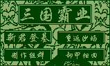 | ✅ Pass | |
| 5 | 仙三外传 | 仙三外传.gam | 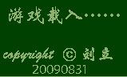 | ✅ Pass | |
| 6 | 仙剑三 | 仙剑三.gam |  | ✅ Pass | |
| 7 | 仙剑奇侠传二之虎啸飞剑 | 仙剑奇侠传二之虎啸飞剑.gam |  | ✅ Pass | |
| 8 | 仙剑奇侠传四回梦游仙 | 仙剑奇侠传四回梦游仙.gam | 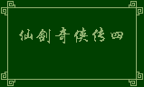 | ✅ Pass | |
| 9 | 仙界传说 | 仙界传说.gam |  | ✅ Pass | |
| 10 | 伏魔记 | 伏魔记.gam |  | ✅ Pass | |
| 11 | 伏魔记(有声版) | 伏魔记(有声版).gam | .png) | ✅ Pass | |
| 12 | 伏魔记 加秘籍 | 伏魔记 加秘籍.gam |  | ✅ Pass | |
| 13 | 伏魔记-伏魔记外传 | 伏魔记-伏魔记外传.gam |  | ⚠️ Warn | Blank frame at 600 frames |
| 14 | 伏魔记-新护神记 | 伏魔记-新护神记.gam |  | ✅ Pass | |
| 15 | 伏魔记-清风传 | 伏魔记-清风传.gam |  | ✅ Pass | |
| 16 | 伏魔记-游戏王 | 伏魔记-游戏王.gam |  | ✅ Pass | |
| 17 | 伏魔记-王柱人传奇 | 伏魔记-王柱人传奇.gam |  | ✅ Pass | |
| 18 | 伏魔记-魔道传奇 | 伏魔记-魔道传奇.gam |  | ⚠️ Warn | Blank frame at 600 frames |
| 19 | 伏魔记之圆梦间奏曲v0.1 | 伏魔记之圆梦间奏曲v0.1.gam |  | ✅ Pass | |
| 20 | 伏魔记圆梦前奏曲(公测版) | 伏魔记圆梦前奏曲(公测版).gam | .png) | ✅ Pass | |
| 21 | 伏魔记怀旧终曲v1.0(原版精修) | 伏魔记怀旧终曲v1.0(原版精修).gam | .png) | ✅ Pass | |
| 22 | 伏魔迷宫 | 伏魔迷宫.gam |  | ⚠️ Warn | Blank frame at 600 frames |
| 23 | 侠客行 | 侠客行.gam | 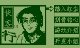 | ✅ Pass | |
| 24 | 侠客行4988(终曲版) | 侠客行4988(终曲版).gam | .png) | ✅ Pass | |
| 25 | 剑缘-第一部 | 剑缘-第一部.gam |  | ✅ Pass | |
| 26 | 十字之门 | 十字之门.gam |  | ✅ Pass | |
| 27 | 同福奇缘 | 同福奇缘.gam |  | ✅ Pass | |
| 28 | 地牢围攻 | 地牢围攻.gam |  | ⚠️ Warn | Blank frame at 600 frames |
| 29 | 基督山传奇 | 基督山传奇.gam |  | ✅ Pass | |
| 30 | 天之骄子 | 天之骄子.gam |  | ✅ Pass | |
| 31 | 天之骄子终曲版 | 天之骄子终曲版.gam |  | ✅ Pass | |
| 32 | 妖 传说 | 妖 传说.gam |  | ⚠️ Warn | Blank frame at 600 frames |
| 33 | 妖·传说终曲版 | 妖·传说终曲版.gam |  | ⚠️ Warn | Blank frame at 600 frames |
| 34 | 封魔录 | 封魔录.gam |  | ✅ Pass | |
| 35 | 将门风云 | 将门风云.gam |  | ✅ Pass | |
| 36 | 少年行 | 少年行.gam |  | ✅ Pass | |
| 37 | 屠魔 | 屠魔.gam |  | ✅ Pass | |
| 38 | 异世大陆 | 异世大陆.gam |  | ✅ Pass | |
| 39 | 异时空游记 | 异时空游记.gam |  | ✅ Pass | |
| 40 | 异时空游记2-纵横之旅 | 异时空游记2-纵横之旅.gam |  | ✅ Pass | |
| 41 | 志在青云 | 志在青云.gam |  | ✅ Pass | |
| 42 | 恶龙传说 | 恶龙传说.gam | 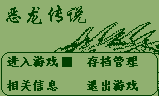 | ✅ Pass | |
| 43 | 战国争霸 | 战国争霸.gam | 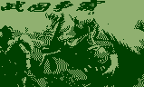 | ✅ Pass | |
| 44 | 新仙剑奇侠传 | 新仙剑奇侠传.gam |  | ✅ Pass | |
| 45 | 新仙剑奇侠传终曲版 | 新仙剑奇侠传终曲版.gam | 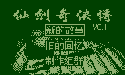 | ✅ Pass | |
| 46 | 新伏魔记 | 新伏魔记.gam |  | ✅ Pass | |
| 47 | 新伏魔S终曲版 | 新伏魔S终曲版.gam |  | ✅ Pass | |
| 48 | 末日传说 | 末日传说.gam | 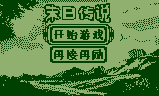 | ✅ Pass | |
| 49 | 校园传奇 | 校园传奇.gam |  | ✅ Pass | |
| 50 | 梦幻校园 | 梦幻校园.gam | 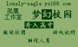 | ✅ Pass | |
| 51 | 梦幻西游 | 梦幻西游.gam |  | ✅ Pass | |
| 52 | 武林新传 | 武林新传.gam | 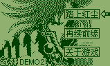 | ✅ Pass | |
| 53 | 洛特传奇 | 洛特传奇.gam |  | ✅ Pass | |
| 54 | 海盗船 | 海盗船.gam |  | ✅ Pass | |
| 55 | 混战三国 | 混战三国.gam |  | ✅ Pass | |
| 56 | 热血传奇 | 热血传奇.gam | 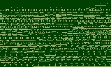 | ✅ Pass | |
| 57 | 牛妞历险记 | 牛妞历险记.gam |  | ✅ Pass | |
| 58 | 王氏传 | 王氏传.gam |  | ✅ Pass | |
| 59 | 生命女神之暗之诅咒 | 生命女神之暗之诅咒.gam |  | ✅ Pass | |
| 60 | 诸神黄昏 | 诸神黄昏.gam | 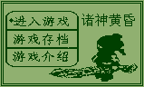 | ⚠️ Warn | Blank frame at 600 frames |
| 61 | 豪斯 | 豪斯.gam | 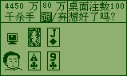 | ✅ Pass | |
| 62 | 金庸群侠传 | 金庸群侠传.gam |  | ✅ Pass | |
| 63 | 金庸群侠传终曲版 | 金庸群侠传终曲版.gam |  | ✅ Pass | |
| 64 | 金庸群侠黑暗时代终曲版 | 金庸群侠黑暗时代终曲版.gam |  | ✅ Pass | |
| 65 | 阶梯小子 | 阶梯小子.gam | 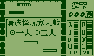 | ✅ Pass | |
| 66 | 英雄剑 | 英雄剑.gam | 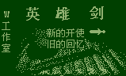 | ✅ Pass | |
| 67 | 英雄剑1 | 英雄剑1.gam |  | ✅ Pass | |
| 68 | 英雄剑2 | 英雄剑2.gam |  | ✅ Pass | |
| 69 | 英雄坛 | 英雄坛.gam | 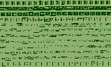 | ✅ Pass | |
| 70 | 英雄坛说 | 英雄坛说.gam |  | ✅ Pass | |
| 71 | 英雄坛说终曲版 | 英雄坛说终曲版.gam | 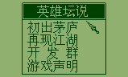 | ✅ Pass | |
| 72 | 英雄战士 | 英雄战士.gam |  | ✅ Pass | |
| 73 | 落世沉浮 | 落世沉浮.gam | 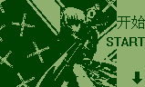 | ✅ Pass | |
| 74 | 蓝色天际 | 蓝色天际.gam |  | ✅ Pass | |
| 75 | 魔塔 | 魔塔.gam |  | ✅ Pass | |
| 76 | 魔塔BT版 | 魔塔BT版.gam |  | ✅ Pass | |
| 77 | 魔塔超级版 | 魔塔超级版.gam |  | ✅ Pass | |
| 78 | 魔法学院 | 魔法学院.gam | 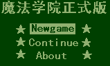 | ✅ Pass | |
| 79 | 黑暗之心 | 黑暗之心.gam |  | ✅ Pass | |
| 80 | 白中传奇 | 白中传奇.gam |  | ✅ Pass | |
| 81 | 紫璇刀 | 紫璇刀.gam |  | ✅ Pass | |
| 82 | 纯蓝记 | 纯蓝记.gam |  | ✅ Pass | |
| 83 | 老观寺传奇 加秘籍 | 老观寺传奇 加秘籍.gam |  | ✅ Pass | |
| 84 | 老观寺传奇终曲版 | 老观寺传奇终曲版.gam |  | ✅ Pass | |

### Puzzle / Strategy Games

| # | 游戏名 | 文件名 | 图片 | Status | Notes |
|---|--------|--------|------|--------|-------|
| 1 | Eros方块 | Eros方块.gam | 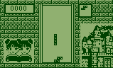 | ✅ Pass | |
| 2 | 中国象棋 | 中国象棋.gam | 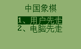 | ✅ Pass | |
| 3 | 二十一点 | 二十一点.gam | 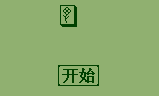 | ✅ Pass | |
| 4 | 二十四点 | 二十四点.gam | 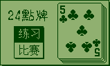 | ✅ Pass | |
| 5 | 五子棋 | 五子棋.gam | 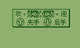 | ✅ Pass | |
| 6 | 升级 | 升级.gam | 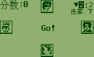 | ✅ Pass | |
| 7 | 华容道 | 华容道.gam | 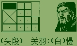 | ✅ Pass | |
| 8 | 对对碰 | 对对碰.gam |  | ✅ Pass | |
| 9 | 幸运花 | 幸运花.gam |  | ⚠️ Warn | Blank frame at 600 frames |
| 10 | 平面魔方 | 平面魔方.gam |  | ✅ Pass | |
| 11 | 扫雷 | 扫雷.gam |  | ✅ Pass | |
| 12 | 拱猪 | 拱猪.gam | 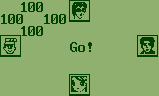 | ✅ Pass | |
| 13 | 接龙 | 接龙.gam |  | ✅ Pass | |
| 14 | 搬运工 | 搬运工.gam | 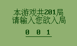 | ✅ Pass | |
| 15 | 比大小 | 比大小.gam |  | ✅ Pass | |
| 16 | 智多星 | 智多星.gam |  | ✅ Pass | |
| 17 | 黑白子 | 黑白子.gam | 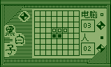 | ✅ Pass | |
| 18 | 碰碰车 | 碰碰车.gam | 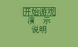 | ✅ Pass | |
| 19 | 蜘蛛侠三 | 蜘蛛侠三.gam |  | ✅ Pass | |
| 20 | 螃蟹回家 | 螃蟹回家.gam | 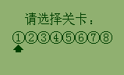 | ✅ Pass | |
| 21 | 贪食蛇 | 贪食蛇.gam | 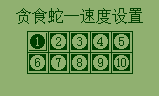 | ✅ Pass | |

### Action / Arcade Games

| # | 游戏名 | 文件名 | 图片 | Status | Notes |
|---|--------|--------|------|--------|-------|
| 1 | DIYtheGAME | DIYtheGAME.gam |  | ✅ Pass | |
| 2 | 乒乓球 | 乒乓球.gam | 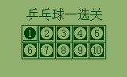 | ✅ Pass | |
| 3 | 丰收 | 丰收.gam | 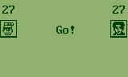 | ✅ Pass | |
| 4 | 体闲麻将 | 体闲麻将.gam |  | ✅ Pass | |
| 5 | 公路快车 | 公路快车.gam | 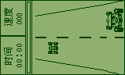 | ✅ Pass | |
| 6 | 冒险岛 | 冒险岛.gam |  | ✅ Pass | |
| 7 | 坦克大战 | 坦克大战.gam | 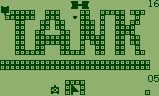 | ✅ Pass | |
| 8 | 大乱斗之火影忍者 | 大乱斗之火影忍者.gam | 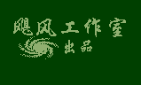 | ✅ Pass | |
| 9 | 大话三国 | 大话三国.gam |  | ✅ Pass | |
| 10 | 宠物精灵 | 宠物精灵.gam | 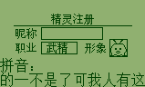 | ✅ Pass | |
| 11 | 电子宠物 | 电子宠物.gam |  | ✅ Pass | |
| 12 | 娱乐无极限之无影奸细 | 娱乐无极限之无影奸细.gam |  | ✅ Pass | |
| 13 | 投篮游戏 | 投篮游戏.gam | 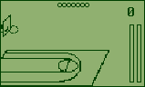 | ✅ Pass | |
| 14 | 抗日小兵 | 抗日小兵.gam |  | ✅ Pass | |
| 15 | 挖金子 | 挖金子.gam |  | ✅ Pass | |
| 16 | 泡泡侠 | 泡泡侠.gam |  | ✅ Pass | |
| 17 | 泡泡侠 加速版 | 泡泡侠 加速版.gam |  | ✅ Pass | |
| 18 | 洛克人 | 洛克人.gam | 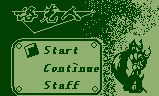 | ✅ Pass | |
| 19 | 滑雪 | 滑雪.gam | 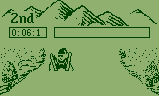 | ✅ Pass | |
| 20 | 潜艇大战 | 潜艇大战.gam | 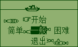 | ✅ Pass | |
| 21 | 炸弹小子 | 炸弹小子.gam | 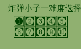 | ✅ Pass | |
| 22 | 烈中轶事 | 烈中轶事.gam | 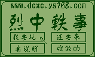 | ✅ Pass | |
| 23 | 猪小弟 | 猪小弟.gam |  | ✅ Pass | |
| 24 | 猫狗大战 | 猫狗大战.gam |  | ✅ Pass | |
| 25 | 赛马 | 赛马.gam | 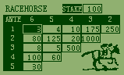 | ✅ Pass | |
| 26 | 赤壁之战 乱世枭雄 | 赤壁之战 乱世枭雄.gam |  | ✅ Pass | |
| 27 | 赤壁之战乱世枭雄终曲版 | 赤壁之战乱世枭雄终曲版.gam | 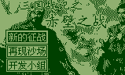 | ✅ Pass | |
| 28 | 跟花 | 跟花.gam | 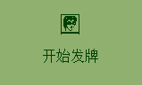 | ✅ Pass | |
| 29 | 跳蛋 | 跳蛋.gam | 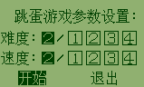 | ✅ Pass | |
| 30 | 过关斩将 | 过关斩将.gam |  | ✅ Pass | |
| 31 | 过关斩将4988(终曲版) | 过关斩将4988(终曲版).gam | .png) | ✅ Pass | |
| 32 | 过关斩将4988改主角 | 过关斩将4988改主角.gam |  | ✅ Pass | |
| 33 | 迷宫游戏 | 迷宫游戏.gam |  | ✅ Pass | |
| 34 | 遗忘传说 | 遗忘传说.gam |  | ✅ Pass | |
| 35 | 遗忘传说终曲版 | 遗忘传说终曲版.gam | 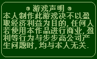 | ✅ Pass | |
| 36 | 释厄传 | 释厄传.gam |  | ✅ Pass | |
| 37 | 钓鱼 | 钓鱼.gam |  | ✅ Pass | |
| 38 | 钓鲨鱼 | 钓鲨鱼.gam |  | ✅ Pass | |
| 39 | 问道 | 问道.gam |  | ✅ Pass | |
| 40 | 飞行特训 | 飞行特训.gam |  | ✅ Pass | |
| 41 | 疯狂校园 | 疯狂校园.gam |  | ✅ Pass | |
| 42 | 疯狂盗墓人 | 疯狂盗墓人.gam |  | ✅ Pass | |
| 43 | 秘密潜入 | 秘密潜入.gam |  | ✅ Pass | |

### Other Games

| # | 游戏名 | 文件名 | 图片 | Status | Notes |
|---|--------|--------|------|--------|-------|
| 1 | 步步高网友俱乐部 | 步步高网友俱乐部.gam |  | ✅ Pass | |
| 2 | 新能源危机 | 新能源危机.gam | 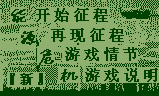 | ✅ Pass | |
| 3 | 最终幻想 | 最终幻想.gam |  | ✅ Pass | |
| 4 | 我的世界 | 我的世界.gam |  | ⚠️ Warn | Blank frame at 600 frames |

## Known Issues

### Blank Frame Games

The following games display a blank frame after 600 frames. This may be expected behavior for games that:
- Require user input to start
- Have long initialization sequences
- Display content after specific game events

| Game | Notes |
|------|-------|
| 伏魔记-魔道传奇 | May require user input |
| 伏魔迷宫 | May require user input |
| 幸运花 | May require user input |

## Testing Methodology

### Smoke Test Process

1. **Load Phase**: Parse GAM file and initialize emulator
2. **Execution Phase**: Run 600 frames (~10 seconds at 60fps)
3. **Verification Phase**: Check LCD framebuffer for content
4. **Screenshot Phase**: Save BMP screenshot for visual inspection

### Frame Content Detection

A frame is considered to have content if the LCD buffer contains more than one distinct pixel value. This detects:
- Games that display menus or text
- Games that show graphics
- Games that animate sprites

## Screenshots

Screenshots are saved in BMP format with green-tinted monochrome LCD simulation:
- **Foreground**: Dark green (#004000) for active pixels
- **Background**: Light green (#90B070) for inactive pixels
- **Resolution**: 159×96 pixels (original BBK LCD resolution)

View screenshots in the `images/` directory or click on the image links in the game tables above.
